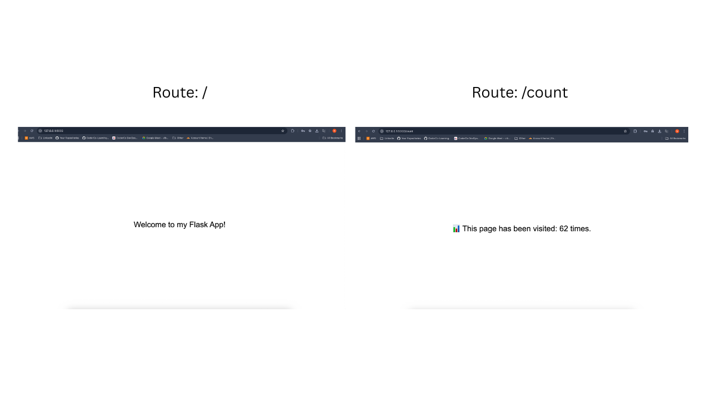

## Hello-Flask App

This project demonstrates how a simple Python Flask application is containerised using Docker.  
Later, the application is extended to run together with a MySQL database using Docker Compose.

---

### Python & Flask Setup

```bash
python3 -m venv venv
source venv/bin/activate
pip install flask
```

### App Overview

The `app.py` file contains a simple Flask application with one route `/`.  
It connects to the MySQL database and retrieves the MySQL version, then displays it in the browser along with a greeting. 

```python
from flask import Flask
import MySQLdb

app = Flask(__name__)

@app.route('/')
def hello_world():
    db = MySQLdb.connect(
        host="mydb",
        user="root",
        passwd="my-secret-pw",
        db="mysql"
    )
    cur = db.cursor()
    cur.execute("SELECT VERSION()")
    version = cur.fetchone()
    return f'Hello, World! MySQL version: {version[0]}'

if __name__ == '__main__':
    app.run(host='0.0.0.0', port=5002)
```

### Dockerfile Steps
A Dockerfile is a text file that contains a series of instructions on how to build a container image for an application.

1. Create Dockerfile

```bash
touch Dockerfile
```

2.	Set base image

```dockerfile
FROM python:3.8-bullseye
WORKDIR /app
COPY . .
```

3.	Install system dependencies

```dockerfile
RUN apt-get update && apt-get install -y --no-install-recommends \
    gcc python3-dev default-libmysqlclient-dev pkg-config \
    && apt-get clean && rm -rf /var/lib/apt/lists/*
```

4.	Install Python dependencies

```dockerfile
RUN pip install --no-cache-dir flask mysqlclient
```

5. Expose port 

```dockerfile
EXPOSE 5002
```

6. Run App
```dockerfile
CMD ["python", "app.py"]
```

### Build Docker Image and Run Container

```bash
docker build -t hello-flask:latest .
docker run -d -p 5002:5002 hello-flask:latest
```


Screenshot showing the Flask app running successfully in a Docker container and accessible via the local browser on port 5002.

---

### Docker Compose (Running Multiple Containers)

Use **Docker Compose** to run the Hello-Flask App with a MySQL database. This creates a shared network for the containers. 

### docker-compose.yml

In this case, the application consists of:
- a **web service** (Flask app)
- a **database service** (MySQL)

```yaml
version: '3.8'

services:
  web:
    image: hello-flask:latest
    ports:
      - "5002:5002"
    depends_on:
      - mydb

  mydb:
    image: mysql:8
    environment:
      MYSQL_ROOT_PASSWORD: my-secret-pw
```

Key points briefly explained:
- services: lists all parts of the application
- image: specifies which Docker image to use
- ports: exposes the Flask app to the local machine
- depends_on: ensures the database starts before the web app

### Running the Application with Docker Compose

```bash
docker-compose up
```

---

### Result

A functional Flask application successfully running in a Docker container and locally accessible on port 5002. Using Docker Compose, the app connects automatically to the MySQL database, showing how multi-container apps can be managed easily and efficiently. 

---

## Flask-Redis App
This project shows step by step how to use Redis to store and retrieve data.
It demonstrates a multi-container setup with Docker Compose, including a Flask web app, a Redis database, and an Nginx load balancer for handling multiple app instances.

### App Overview

The Flask_App.py file contains a Flask application with two routes:
	•	/ : Displays a welcome message in large text, centered on the page.
	•	/count : Displays a visitor count stored in Redis.

```python
from flask import Flask
import redis

app = Flask(__name__)

redis_client = redis.Redis(
    host='redis',
    port=6379,
    decode_responses=True
)

@app.route('/')
def welcome():
    return "Welcome to my Flask App!"

@app.route('/count')
def count():
    count = redis_client.incr('visitor_count')
    return f"📊 This page has been visited: {count} times."

if __name__ == '__main__':
    app.run(host='0.0.0.0', port=5002)
```

### Dockerfile

```dockerfile
FROM python:3.11-slim
WORKDIR /App
COPY . .
RUN pip install --no-cache-dir flask==3.1.2 redis==5.2.0
EXPOSE 5002
CMD ["python", "Flask_App.py"]
```

### Docker Compose

The application is run together with a Redis database, creating a shared network for the containers.
- services: define the different parts of the application (web, redis, nginx).
- volumes: allow data to persist even if a container stops or is removed (here redis-data stores Redis data).

```yaml
version: '3.11'

services:
  web:
    build: .
    expose:
      - "5002"
    depends_on:
      - redis

  redis:
    image: "redis:latest"
    ports:
      - "6379:6379"
    volumes:
      - redis-data:/data

  nginx:
    image: nginx:latest
    ports:
      - "5002:5002"
    volumes:
      - ./nginx.conf:/etc/nginx/nginx.conf
    depends_on:
      - web

volumes:
  redis-data:
```

### nginx.conf file 

``` 
events {}

http {
    upstream flask_app {
        server web:5002;
    }

    server {
        listen 5002;

        location / {
            proxy_pass http://flask_app;
        }
    }
}
``` 

Why use Nginx here?
- When scaling the Flask app to multiple containers, you can’t bind all instances to the same host port.
- Nginx acts as a reverse proxy / load balancer, distributing incoming requests across multiple Flask containers.
- This setup makes the application capable to handle higher traffic.


### Build and Run

```bash
docker build -t flask-redis:v1 .
docker-compose up
```

The application is accessible locally at http://127.0.0.1:5002.

### Result

A fully functional Flask application that keeps track of visitor counts, connected to a Redis database, all running in Docker containers.
